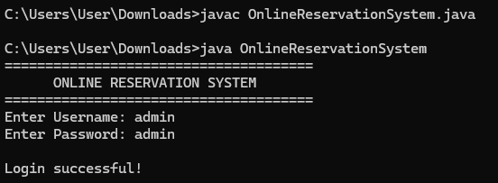
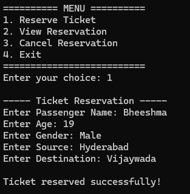
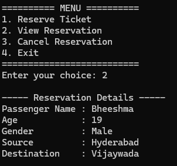
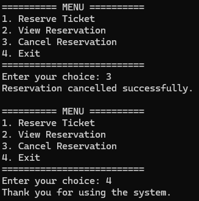

# Task 1 – Online Reservation System

## Objective

To develop a Java-based Online Reservation System that allows users to perform basic ticket reservation operations through a console-based application.

---

## Description

The Online Reservation System is a console-based Java application developed to demonstrate fundamental Java programming and Object-Oriented Programming concepts.

The application provides a menu-driven interface through which users can log in, reserve a ticket, view reservation details, cancel a reservation, and exit the system.

---

## Features

### 1. User Login

The system provides a basic login mechanism using a username and password.

### 2. Ticket Reservation

The user can enter passenger information including:

- Passenger Name
- Age
- Gender
- Source
- Destination

### 3. View Reservation

The application displays the details of the currently reserved ticket.

### 4. Cancel Reservation

The user can cancel an existing reservation.

### 5. Exit

The user can safely exit the application.

---

## Technologies Used

- Java
- Java Scanner
- Object-Oriented Programming
- Console Application

---

## Concepts Used

- Classes and Objects
- Methods
- Variables
- Data Types
- Conditional Statements
- Loops
- Switch Statement
- User Input
- Encapsulation
- Menu-Driven Programming

---

## Implementation

The application is implemented using Java.

The program contains separate methods for:

- Ticket Reservation
- Viewing Reservation
- Cancelling Reservation

The main method provides the menu-driven interface and controls the overall application flow.

---

## Login Credentials

For demonstration purposes:

**Username:** admin

**Password:** admin

---

## Sample Operations

The application supports the following operations:

1. Reserve Ticket
2. View Reservation
3. Cancel Reservation
4. Exit

---

## Screenshots

### Login

### Ticket Reservation

### Reservation Details

### Cancellation

---

## Learning Outcomes

Through this project, the following skills were developed:

- Java Programming
- Object-Oriented Programming
- User Input Handling
- Menu-Driven Application Development
- Conditional Logic
- Method Implementation
- Basic Data Management
- Problem Solving

---

## Result

A functional console-based Online Reservation System was successfully developed using Java. The application allows users to log in, reserve tickets, view reservation details, cancel reservations, and exit the system.

---

## Author

**A. Bheeshma Shankar**

GitHub: [Bheeshma2234](https://github.com/Bheeshma2234)
