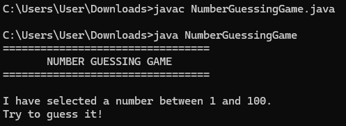
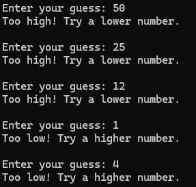
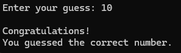

# Task 2 – Number Guessing Game

## Objective

To develop a Java-based Number Guessing Game that allows users to guess a randomly generated number through a console-based application.

## Description

The Number Guessing Game is a console-based Java application developed to demonstrate fundamental Java programming and problem-solving concepts.

The application generates a random number between 1 and 100. The user attempts to guess the number, and the program provides hints indicating whether the entered number is too high or too low.

The game continues until the user correctly guesses the generated number.

## Features

### 1. Random Number Generation

The system generates a random number between 1 and 100 using the Java Random class.

### 2. User Guess

The user can enter a number as their guess through the console.

### 3. Guess Validation

The application compares the user's guess with the randomly generated number.

### 4. Hints

The system provides appropriate hints based on the user's guess:

- Too Low – Try a higher number
- Too High – Try a lower number
- Correct Guess – The number has been guessed successfully

### 5. Attempt Counter

The application keeps track of the number of attempts made by the user.

### 6. Game Completion

The game ends when the user correctly guesses the generated number and displays the total number of attempts.

## Technologies Used

- Java
- Java Scanner
- Java Random
- Console Application

## Concepts Used

- Classes and Objects
- Methods
- Variables
- Data Types
- Random Number Generation
- Conditional Statements
- While Loop
- User Input
- Counters
- Problem Solving

## Implementation

The application is implemented using Java.

The program generates a random number using the Random class and accepts user input using the Scanner class.

Conditional statements are used to compare the user's guess with the generated number.

A loop is used to repeatedly accept guesses until the correct number is entered.

The number of attempts is maintained and displayed when the game is completed.

## Game Rules

1. The computer generates a random number between 1 and 100.
2. The user enters a guess.
3. If the guess is lower than the generated number, the system displays a message to try a higher number.
4. If the guess is higher than the generated number, the system displays a message to try a lower number.
5. If the guess matches the generated number, the user wins the game.
6. The total number of attempts is displayed.

## Sample Operations

The application performs the following operations:

1. Generate Random Number
2. Enter User Guess
3. Compare Guess
4. Display Hint
5. Count Attempts
6. Display Result
7. Exit Game

## Sample Output

### Game Start

I have selected a number between 1 and 100.
Try to guess it!

Enter your guess: 50

### Incorrect Guess

Too low! Try a higher number.

Enter your guess: 75

Too high! Try a lower number.

### Correct Guess

Enter your guess: 68

Congratulations!
You guessed the correct number.

Number of attempts: 4

## Screenshots

### Game Start

### User Guess

### Hint Display

### Correct Guess

## Learning Outcomes

Through this project, the following skills were developed:

- Java Programming
- Random Number Generation
- User Input Handling
- Conditional Logic
- Loop Implementation
- Counter Implementation
- Console Application Development
- Problem Solving
- Basic Java Programming Concepts

## Result

A functional console-based Number Guessing Game was successfully developed using Java. The application generates a random number, accepts user guesses, provides appropriate hints, counts the number of attempts, and displays the result when the correct number is guessed.

## Author

**A. Bheeshma Shankar**

GitHub: [Bheeshma2234](https://github.com/Bheeshma2234)
