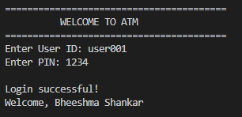
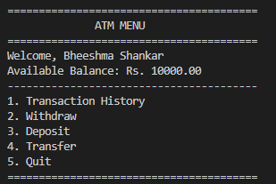
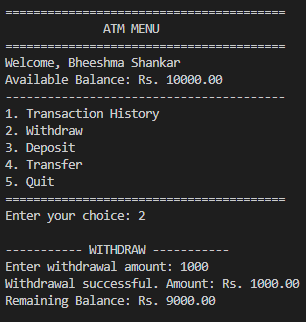
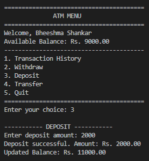
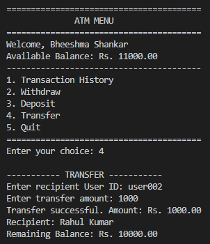
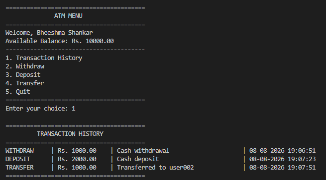

# Task 3 – ATM Interface

## Objective

To develop a console-based ATM Interface using Java that allows users to authenticate using a User ID and PIN and perform standard banking transactions such as checking transaction history, withdrawing money, depositing money, transferring money, and quitting the application.

## Description

The ATM Interface is a Java console application developed using Object-Oriented Programming concepts.

The application simulates the basic operations of an Automated Teller Machine. Users must authenticate using their User ID and PIN before accessing the ATM menu.

After successful authentication, users can perform different banking operations including withdrawal, deposit, money transfer, and viewing transaction history.

The application also validates account balance before allowing withdrawals and transfers and stores transactions using an ArrayList.

## Features

### 1. User Authentication

The system asks the user to enter:

- User ID
- PIN

The user is allowed a maximum of three login attempts.

If incorrect credentials are entered three times, access to the ATM is denied.

### 2. Transaction History

The user can view all transactions performed during the current session.

Transactions are stored using an ArrayList and displayed clearly.

### 3. Withdraw

The user can enter the amount to withdraw.

The system checks whether sufficient balance is available before processing the transaction.

If the balance is insufficient, the system displays:

`Insufficient Funds`

### 4. Deposit

The user can enter an amount to deposit.

The amount is added to the account balance and the transaction is recorded in the transaction history.

### 5. Transfer

The user can transfer money to another account using the recipient account ID.

The system validates the available balance before processing the transfer.

Both the sender and recipient account balances are updated.

### 6. Quit

The user can exit the ATM application through the Quit option.

A goodbye message is displayed before the program terminates.

## Technologies Used

- Java
- Java Collections
- ArrayList
- Object-Oriented Programming
- Console Application

## Java Classes

The project contains five main Java classes:

### ATM.java

Controls the ATM operations and provides methods for withdrawal, deposit, transfer, and transaction history.

### Account.java

Represents a bank account and stores account information such as User ID, PIN, account holder name, and balance.

### Transaction.java

Represents an individual banking transaction and stores transaction details.

### Bank.java

Manages multiple accounts and provides account lookup functionality.

### Main.java

Contains the main method and starts the ATM application.

## Concepts Used

- Classes and Objects
- Encapsulation
- Constructors
- Methods
- Private Fields
- Getters and Setters
- ArrayList
- Switch-Case
- Loops
- Conditional Statements
- User Input using Scanner
- Object-Oriented Programming

## ATM Menu

After successful login, the following menu is displayed:

1. Transaction History
2. Withdraw
3. Deposit
4. Transfer
5. Quit

## Authentication

The application provides secure access through User ID and PIN authentication.

The system allows a maximum of three incorrect login attempts.

## Balance Validation

Before processing a withdrawal or transfer, the system checks whether the account has sufficient balance.

If the balance is insufficient, the transaction is rejected and the following message is displayed:

`Insufficient Funds`

## Transaction Management

All transactions performed during the current session are stored in an ArrayList.

The transaction history includes:

- Transaction Type
- Amount
- Account information
- Transaction description

## Sample Operations

The application supports:

1. Login
2. View transaction history
3. Withdraw money
4. Deposit money
5. Transfer money
6. Quit

## Screenshots

### Login

### ATM Menu

### Withdraw

### Deposit

### Transfer

### Transaction History

## Learning Outcomes

Through this project, the following skills were developed:

- Java Programming
- Object-Oriented Programming
- Encapsulation
- Collection Framework
- ArrayList
- User Authentication
- Banking Transaction Management
- Input Validation
- Console Application Development
- Problem Solving

## Result

A functional console-based ATM Interface was successfully developed using Java. The application provides user authentication and supports transaction history, withdrawal, deposit, money transfer, and exit operations while maintaining account balances and transaction records.

## Author

**A. Bheeshma Shankar**

GitHub: [Bheeshma2234](https://github.com/Bheeshma2234)
